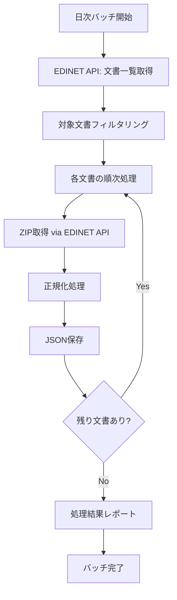

# EDINET日次バッチ処理システム設計仕様書

## 1. 概要

EDINET APIから一日分の文書リストを取得し、対象文書を自動でダウンロード・正規化処理して結果をJSON形式で保存する日次バッチ処理システムの設計仕様書です。

## 2. 背景・目的

### 2.1 現在の実装状況

- ✅ **単体処理**: `edinet-list`（一覧取得）、`edinet-fetch`（個別取得）
- ✅ **正規化処理**: `EdinetNormalizedProcessor`（Phase 1実装済み）
- ✅ **API統合**: `EdinetApiClient`（文書一覧・取得API対応）

### 2.2 課題

- **手動処理**: 現在は個別文書のマニュアル処理のみ
- **メタデータ欠如**: `filer_name`, `doc_type`などがnullで保存
- **効率性**: 日次での大量処理に対応していない
- **網羅性**: 対象文書の自動判定・処理が未対応

### 2.3 目標

- **自動化**: 日次での一括処理により人的作業を削減
- **メタデータ強化**: EDINET API情報を活用した完全な文書情報保存
- **効率的処理**: 対象文書の自動判定と並列処理によるパフォーマンス向上
- **拡張性**: 将来的な処理対象拡大への対応基盤構築

## 3. 機能要件

### 3.1 基本処理フロー（シンプル化）



### 3.2 処理ステップ詳細

#### Step 1: 文書一覧取得

- **API**: `GET /api/v2/documents.json?date={YYYY-MM-DD}&type=2`
- **対象**: 指定日付の全提出文書
- **データ**: EdinetDocument配列（メタデータ含む）

#### Step 2: 対象文書フィルタリング

- **MVP対象**: 有価証券報告書・四半期報告書のみ
- **判定条件**:
  - `csvFlag = "1"` (CSV取得可能)
  - `docTypeCode` が対象書類コード
  - `withdrawalStatus != "1"` (取下げ文書除外)

#### Step 3: 文書取得・正規化

- **ZIP取得**: `GET /api/v2/documents/{docId}?type=5`
- **正規化**: `EdinetNormalizedProcessor.processZipToNormalized()`
- **メタデータ統合**: API情報を`DocumentRecord`に反映

#### Step 4: 結果保存

- **形式**: 正規化JSON（`{docId}_normalized.json`）
- **場所**: `tmp/batch/{YYYY-MM-DD}/` 配下
- **統計**: バッチ処理サマリ情報

## 4. 技術仕様

### 4.1 対象文書種別（MVP）

| 文書種別       | docTypeCode | 説明             |
| -------------- | ----------- | ---------------- |
| 有価証券報告書 | 120         | 年次財務報告書   |
| 四半期報告書   | 130         | 四半期財務報告書 |

### 4.2 データ構造強化

#### DocumentRecord拡張

```typescript
type DocumentRecord = {
  document_id: string; // docID
  edinet_code: string | null; // edinetCode (APIから)
  filer_name: string | null; // filerName (APIから)
  doc_type: string | null; // docTypeCode → 文書種別名変換
  form_code: string | null; // formCode (APIから)
  period_start: string | null; // periodStart (APIから)
  period_end: string | null; // periodEnd (APIから)
  filed_at_jst: string | null; // submitDateTime (APIから)
  has_csv: boolean; // csvFlag === "1"
  processed_at: string; // バッチ処理日時
  source: "EDINET v2";

  // バッチ処理用追加フィールド
  seq_number: number; // seqNumber (処理順序)
  doc_description: string | null; // docDescription
  batch_date: string; // バッチ対象日付
};
```

#### BatchProcessingResult

```typescript
type BatchProcessingResult = {
  batch_date: string;
  total_documents: number;
  target_documents: number;
  processed_documents: number;
  failed_documents: number;
  processing_time_ms: number;
  documents: DocumentRecord[];
  errors: BatchProcessingError[];
};

type BatchProcessingError = {
  doc_id: string;
  filer_name: string | null;
  error_type: "FETCH_ERROR" | "PROCESSING_ERROR" | "SAVE_ERROR";
  error_message: string;
  timestamp: string;
};
```

### 4.3 クラス構造

#### EdinetDailyBatchProcessor

```typescript
export class EdinetDailyBatchProcessor {
  constructor(
    private apiClient: EdinetApiClient,
    private normalizedProcessor: EdinetNormalizedProcessor
  );

  // メインバッチ処理
  async processDailyBatch(targetDate: string): Promise<BatchProcessingResult>;

  // 対象文書フィルタリング
  private filterTargetDocuments(documents: EdinetDocument[]): EdinetDocument[];

  // 単一文書処理
  private async processDocument(document: EdinetDocument): Promise<NormalizedResult>;

  // メタデータ統合
  private createDocumentRecord(
    edinetDoc: EdinetDocument,
    normalizedResult: NormalizedResult
  ): DocumentRecord;

  // 結果保存
  private async saveResults(
    targetDate: string,
    results: BatchProcessingResult
  ): Promise<void>;
}
```

#### 固定設定値

```typescript
// 実装内で固定値として定義
const BATCH_CONFIG = {
  target_doc_types: ["120", "130"], // 有価証券報告書・四半期報告書
  output_directory: "tmp/batch",
};
```

### 4.4 ファイル出力構造

```
tmp/batch/{YYYY-MM-DD}/
├── batch_summary.json          # バッチ処理サマリ
├── documents/                  # 個別文書JSON
│   ├── S100XXXX_normalized.json
│   ├── S100YYYY_normalized.json
│   └── ...
└── errors/                     # エラーログ
    └── batch_errors.json
```

### 4.5 処理方針（シンプル化）

- **順次処理**: 並列処理は行わず、順次処理でシンプルに実装
- **エラー時終了**: 一つでもエラーが発生したらバッチ全体を終了
- **固定設定**: 設定値は実装内で固定（保守性重視）
- **十分なログ**: 進捗と詳細な処理状況をコンソールに出力

## 5. コマンドインターフェース

### 5.1 CLI仕様

```bash
# npm start を使用したシンプルな実行
npm start batch 2025-08-08

# 日付のみを引数として受け取る
npm start batch YYYY-MM-DD
```

### 5.2 引数

| 引数位置 | 名称         | 必須 | 説明                          |
| -------- | ------------ | ---- | ----------------------------- |
| 1        | サブコマンド | ○    | "batch" 固定                  |
| 2        | 日付         | ○    | 処理対象日付 (YYYY-MM-DD形式) |

## 6. エラーハンドリング（シンプル化）

### 6.1 エラー時の動作

- **即座に終了**: エラー発生時はバッチ全体を停止
- **詳細ログ出力**: エラーの詳細をコンソールに出力
- **exit code 1**: プロセス終了時にエラーコードを返す

### 6.2 エラー分類

1. **API接続エラー**: ネットワーク・認証エラー
2. **文書取得エラー**: 個別文書のダウンロード失敗
3. **処理エラー**: ZIP展開・正規化処理失敗
4. **保存エラー**: ファイル保存・ディスク容量エラー

### 6.3 ログ出力

- **進捗ログ**: 「X/Y 文書処理中...」形式で進捗表示
- **エラーログ**: エラー発生時の詳細情報
- **サマリログ**: 処理完了時の統計情報

## 7. 実装計画（シンプル化）

### 一括実装（3-5日）

- [ ] `EdinetDailyBatchProcessor`基本実装
- [ ] 対象文書フィルタリング機能
- [ ] 単一文書処理パイプライン（順次処理）
- [ ] メタデータ統合機能
- [ ] バッチコマンド実装
- [ ] 基本的なエラーハンドリング（エラー時終了）
- [ ] ログ出力機能
- [ ] 統合テスト

## 8. テスト方針（シンプル化）

### 8.1 基本テスト

- **単体テスト**: 主要メソッドの動作確認
- **統合テスト**: 実際のEDINET APIでの動作確認
- **手動テスト**: 実データでのエンドツーエンドテスト

### 8.2 品質目標

- **基本動作**: エラーなく実行完了
- **データ品質**: メタデータが正しく統合されること
- **ログ品質**: 十分な情報がログ出力されること

## 9. 将来拡張の検討事項

### 可能な拡張

- **対象文書の拡大**: 他の文書種別への対応
- **データベース連携**: 結果をデータベースに保存
- **スケジューラ統合**: cron等での定期実行
- **通知機能**: 完了・エラー通知

---

この設計仕様に基づき、段階的にEDINET日次バッチ処理システムを実装し、手動処理からの完全自動化を実現します。
